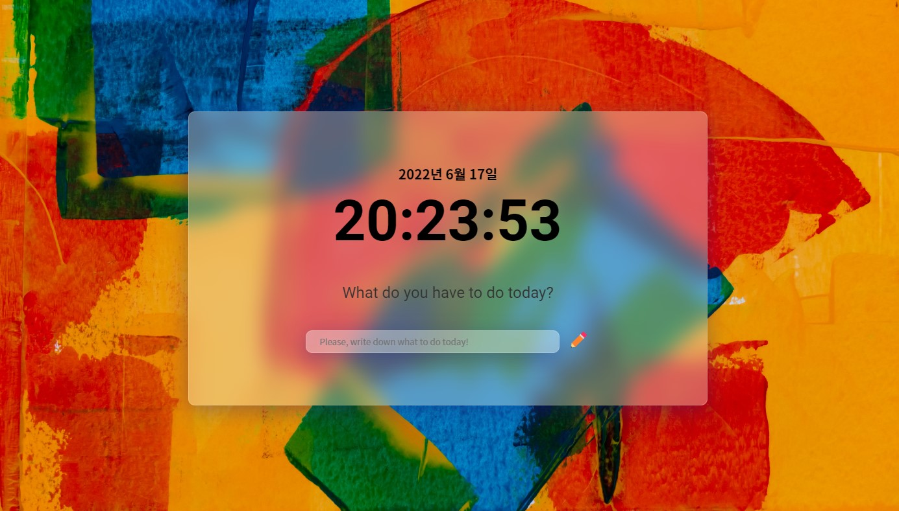
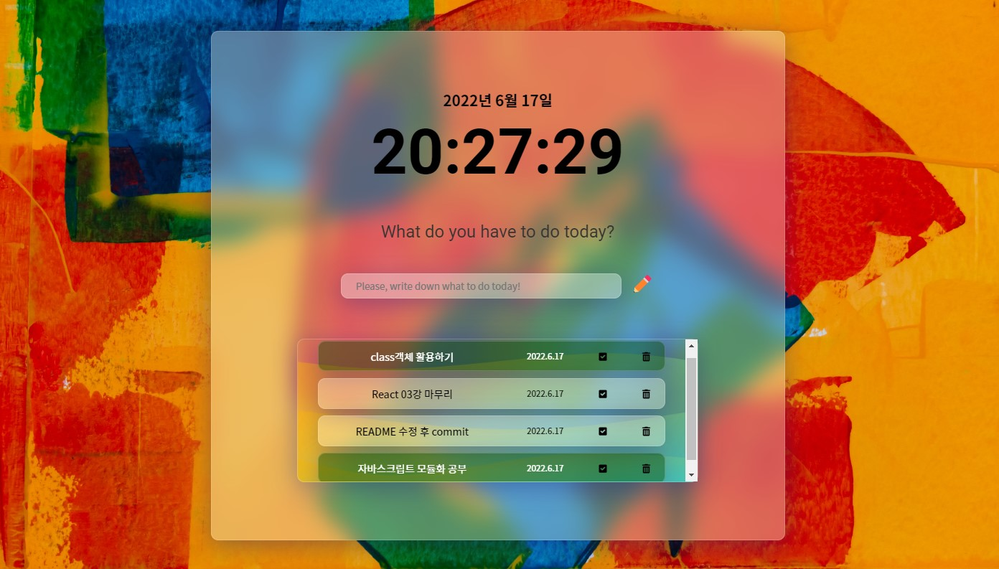

# 📝todo-list

#### 📝Todo-list : 오늘의 Todo-list기록하기

https://junvely-todo-list.netlify.app/

##### main 화면

##### main - Todo-list 추가 시 화면

# 📝todo-list 기능

- 실시간 날짜 및 시간 업데이트 기능

- form이 submit되면 Todo를 리스트에 추가 + 삭제/완료 기능

- localStorage에 Todo-list를 저장하여 새로고침 시에도 Todo-list가 기억됨

 

# ✅ Takeaway 느낀점/개선할점

- classList.add시 그 전에 적용돼 있는 스타일과 중복되는 속성일 경우 후에 적용한 스타일이 무시된다. (기존 display:flex > display:none x > visibility활용 가능)

- class 내부의 함수를 다른 곳의 인자로 보내면 class정보는 전달되지 않는다.(this bounding 필요) 예상하지 못한 곳에서 에러발생할 수 있다.

- 객체를 통해 속성값을 참조하면 효율적으로 데이터에 접근할 수 있다. (todo > todo {text: input.value, id : id })

- 비교연산자 ===,!==를 사용할 경우, 서로 다른 데이터 타입인지 두개의 타입을 확인하고 필요시 변환하여 비교한다. (todo.id !== parseInt(id))
